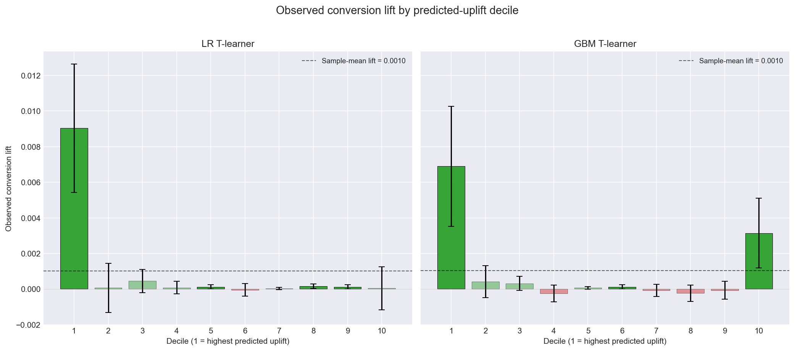
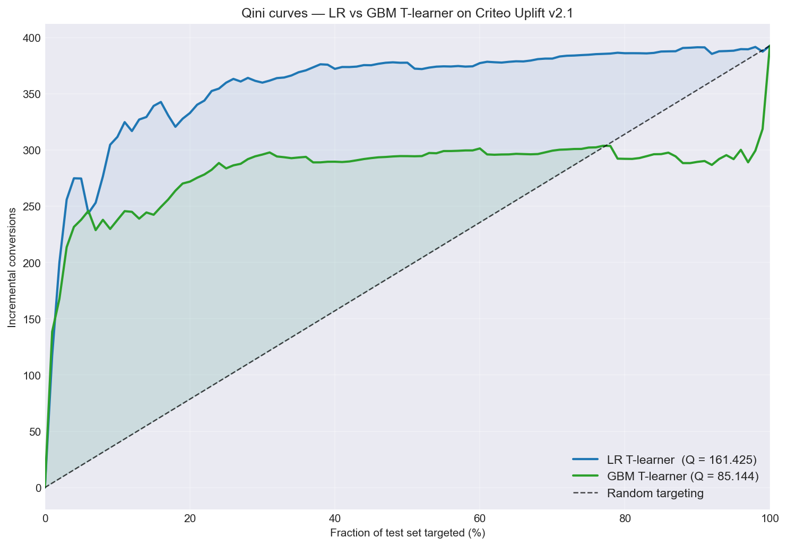

# Criteo Uplift Modeling Report

## Background

Criteo, a global digital advertising platform, faces the challenge every ad-targeting business shares: most users who see an ad would have converted (or not) regardless of whether they saw it. Spending budget on these users delivers no incremental value. The real targeting problem is identifying the subset of users whose behavior is actually *changed* by the ad — the responders — and concentrating spend on them. This analysis uses the Criteo Uplift v2.1 dataset (13.9M users, ~85% randomly treated) to build models that estimate per-individual treatment effects and to quantify the business value of uplift-based targeting versus untargeted spend.

## Executive Summary

Our analysis demonstrates that uplift modeling on Criteo's randomized advertising experiment produces a clean, deployable ranking of users by predicted treatment response. The top decile of the logistic regression T-learner identifies users who convert at 7.85× the sample-average treatment lift, while the bottom decile shows zero measurable response. Targeting only the top 20% of users captures 84.8% of the total incremental conversions that treat-everyone would deliver — at one-fifth of the cost. Counterintuitively, a logistic regression baseline outperforms a LightGBM T-learner on this dataset, a finding traceable to Criteo's anonymizing random projection of features. The following sections detail the key findings and strategic recommendations.

## Insights

1. **Top-Decile Concentration of Response:**

  - Users in the top 10% of predicted-uplift respond to advertising at 7.85× the sample-average rate (observed lift 0.00904 vs sample mean 0.00115).
  - The bottom 10% shows an observed lift of 0.000041 — effectively zero, meaning treatment has no measurable effect on this segment.
  - This 222× top-to-bottom ratio confirms the model's ranking is highly discriminative at the extremes.

2. **Strong Ranking Quality at Realistic Budgets:**

  - At a 20% budget, the model delivers 332.9 incremental conversions versus 78.5 from random targeting — a 4.24× efficiency multiplier.
  - The same 20% budget captures 84.8% of the total incremental conversions available from treating everyone.
  - At a 10% budget, the model is 7.9× more efficient than random selection, with 311.6 incremental conversions.

3. **Linear Models Outperform Gradient Boosting on This Data:**

  - Logistic regression T-learner: Qini = 161.4, top-decile lift = 0.00904.
  - LightGBM T-learner: Qini = 85.1, top-decile lift = 0.00689.
  - The gap is consistent across every metric (Qini, top-K, decile separation), suggesting that Criteo's anonymizing random projection preserved linear feature structure while compressing the non-linear interactions LightGBM is designed to exploit.

4. **Feature Heterogeneity Is Concentrated in Three Features:**

  - Features `f4`, `f2`, and `f9` show the largest variation in treatment lift across feature quartiles — these are the primary drivers of the model's predictions.
  - Feature `f3` contains a quartile with significantly negative lift, identifying a user segment that responds less when treated.
  - The bottom-ranked features (`f1`, `f5`, `f11`) explain who converts but not who responds to treatment, contributing little to differential targeting.

5. **Experiment Quality Is Excellent:**

  - Sample ratio mismatch test passes cleanly (p = 0.9989), with treatment split exactly 85.0000% / 15.0000%.
  - The conversion ATE (0.00115) is statistically highly significant (z = 33.5, p < 1e-200), representing a 59.4% relative lift over the control rate of 0.00194.
  - The visit ATE (0.01034, 27.1% relative lift) confirms treatment moves users through the funnel.

## Recommendations

1. **Deploy Logistic Regression for Production Targeting:**

  - The LR T-learner outperforms LightGBM on every metric while training in seconds instead of minutes — a rare case where the simpler model is both better and faster.
  - Refresh the model monthly on rolling data, with stratification preserved on (treatment, conversion) to handle the 0.2% rare-event class.
  - Pickle the fitted scaler alongside the model — predictions on new data require the exact same feature standardization.

2. **Adopt a Top-20% Targeting Budget as the Default:**

  - At 20% of the cost of treat-everyone, the model captures 84.8% of total uplift — the diminishing-returns inflection point in the Qini curve.
  - Going to top 30% adds only 8% more incremental conversions for 50% more cost; going below top 10% loses meaningful coverage.
  - Communicate this to media planners as "spend 20% to capture 85%" — the cleanest business framing of the uplift advantage.

3. **Eliminate Spend on Bottom-Decile Users:**

  - The bottom decile shows zero observed lift; treating these users produces no measurable incremental conversions.
  - Removing them from targeted campaigns recovers ~10% of budget with no loss in performance — pure efficiency gain.
  - This is the single highest-confidence recommendation in the analysis given the bottom-decile lift is statistically indistinguishable from zero.

4. **Invest in Feature Engineering, Not Model Complexity:**

  - LightGBM's failure to beat logistic regression indicates the available signal is already linearly captured. Further model complexity (X-learner, causal forest) will likely deliver similar marginal returns.
  - The highest-leverage next investment is recovering behavioral features lost to anonymization, or augmenting with external data sources (browsing history, contextual signals).
  - Re-run this analysis on the augmented features before considering more sophisticated model architectures.

5. **Build the Uplift Pipeline as Standard Infrastructure:**

  - The four-notebook pipeline (EDA → experimentation → modeling → evaluation) runs end-to-end in ~20 minutes on a 2M-row subsample, making weekly or campaign-level iteration practical.
  - The Qini, top-K, and decile evaluation modules are reusable across campaigns; the T-learner accepts any sklearn-compatible base model for easy A/B testing.
  - Treat the experimentation analysis (SRM, ATE with CIs) as a required gate before any targeting model is trained — it catches randomization bugs that would otherwise silently bias the uplift estimates.

By implementing these recommendations, Criteo can target its highest-responding 20% of users with 4.24× the efficiency of untargeted spend, eliminate budget waste on the unresponsive bottom decile, and build a reusable uplift-modeling infrastructure that supports rapid campaign iteration. The full technical methodology and per-decile feature profiles are documented in `docs/writeups/`.