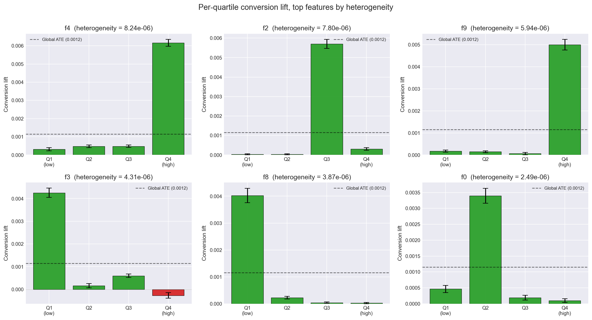

# Experimentation Analysis

Validation of the Criteo Uplift v2.1 experiment and identification of
features with treatment heterogeneity for downstream uplift modeling.

## 1. Data overview

- **Dataset:** Criteo Uplift v2.1 (Diemert et al., AdKDD 2018)
- **Rows:** 13,979,592
- **Features:** 12 anonymized dense floats (`f0`–`f11`)
- **Treatment:** randomly assigned, nominal 85/15 treated/control split
- **Outcomes:** `visit` (4.7% control rate), `conversion` (0.19% control rate)

## 2. Sample Ratio Mismatch (SRM)

| | Observed | Expected (85/15) |
|---|---|---|
| Treated | 11,882,655 | 11,882,653 |
| Control | 2,096,937  | 2,096,939  |
| **Total** | **13,979,592** | **13,979,592** |

- **Chi-square statistic:** 0.00
- **p-value:** 0.9989
- **Observed treated share:** 0.850000
- **Absolute deviation from 85%:** +0.0000 pp

**Interpretation:** The observed split is statistically indistinguishable
from the documented 85/15 target. No SRM detected; randomization passes
this validation. Note that with n = 14M, this test has the power to
detect deviations of <0.01 percentage points, so passing is meaningful.

## 3. Average Treatment Effect

ATE estimated as the difference of outcome means between treated and
control arms (intent-to-treat using the random `treatment` assignment,
not the post-randomization `exposure` indicator). Standard errors via
the difference-of-proportions formula. Computed in SQL; p-values added
in Python via `scipy.stats.norm`.

### Formula

ATE     = p_t - p_c
SE      = sqrt( p_t (1 - p_t) / n_t + p_c (1 - p_c) / n_c )
95% CI  = ATE ± 1.96 · SE
z       = ATE / SE
p       = 2 · (1 − Φ(|z|))

### Results

| outcome | control_rate | treatment_rate | ATE | 95% CI | z | p-value |
|---|---|---|---|---|---|---|
| visit      | 0.038201 | 0.048543 | 0.010342 | [0.010056, 0.010629] | 70.7 | <1e-200 |
| conversion | 0.001938 | 0.003089 | 0.001152 | [0.001085, 0.001219] | 33.5 | <1e-200 |

### Interpretation

- **Visit:** Treatment lifts the visit rate by 1.03 percentage points
  in absolute terms — a **27.1% relative lift** over the control rate
  of 3.82%. The 95% CI is tight ([0.010056, 0.010629]) and excludes
  zero by ~70 standard errors.
- **Conversion:** Absolute lift of 0.115 percentage points on a
  control base rate of 0.19% — a **59.4% relative lift**. Despite the
  tiny absolute effect, the relative magnitude is large and the
  estimate is highly significant (z = 33.5).

The conversion-lift relative magnitude (~59%) is roughly 2× the visit
lift (~27%). This makes sense: treatment moves the funnel from awareness
(visit) through to conversion, with proportionally larger downstream
effects. It also implies that a model good at identifying high-intent
treated users will pay off more in conversion targeting than in visit
targeting.

## 4. Treatment heterogeneity

Uplift modeling can only beat random targeting if treatment effects
vary across users. We bucket each feature into quartiles via
`NTILE(4) OVER (ORDER BY f_i)`, compute conversion lift per bucket, and
rank features by the variance of bucket-level lift.

### Pipeline check and a finding

For each feature, we compared the row-count-weighted mean of bucket
lifts to the global conversion ATE (0.001152). They agree exactly only
if the treatment ratio is constant across all buckets of that feature.
In Criteo v2.1, deviations range from −22% (`f10`) to +61% (`f4`),
indicating that **treatment ratio varies meaningfully across feature
quartiles**. This is consistent with the documented non-uniform
sub-sampling of the original experiment. The variance-of-lift
heterogeneity score remains a valid signal for which features carry
differential treatment response — it just isn't anchored to the
unconditional ATE.

### Top features by heterogeneity score

| rank | feature | heterogeneity_score | lift range |
|---|---|---|---|
| 1 | f4 | 8.24e-06 | [0.000310, 0.006162]  |
| 2 | f2 | 7.80e-06 | [0.000030, 0.005703]  |
| 3 | f9 | 5.94e-06 | [0.000063, 0.005002]  |
| 4 | f3 | 4.31e-06 | [−0.000266, 0.004257] |
| 5 | f8 | 3.87e-06 | [0.000026, 0.004026]  |
| 6 | f0 | 2.49e-06 | [0.000101, 0.003395]  |

The chart shows per-quartile conversion lift with 95% CI error bars,
relative to the global conversion ATE (dashed line). Bars are green
for positive lift, red for negative; faded bars indicate CIs that
cross zero.

### Interpretation

- **f4 and f2** show the largest spread, with the most-responsive
  quartile delivering a lift roughly 5× the global ATE. These will be
  the strongest signals for the uplift model.
- **f3 contains a negative-lift quartile** (lift = −0.000266). This is
  actionable: the model can use f3 to identify users to *avoid*
  targeting — they convert less when treated, possibly due to ad
  fatigue or audience mismatch.
- **The bottom-ranked features (f1, f5, f11)** show roughly flat lift
  across quartiles. They explain *who converts* but not *who responds
  to treatment*, so they contribute little to differential targeting.

The full per-bucket data is in `docs/figures/heterogeneity_results.csv`
(48 rows: 12 features × 4 buckets) and the full ranking is in
`docs/figures/feature_rank.csv`.