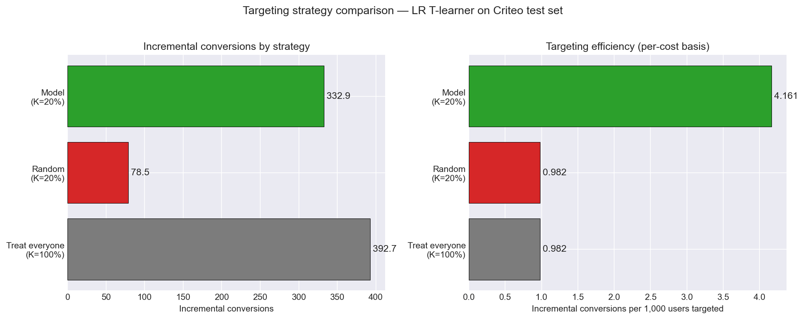

# Results

## Section 1 — Top-K and strategy comparison (LR T-learner)

The Qini coefficient measures ranking quality over all budget levels.
For a business audience, the more useful question is: at a fixed
budget, how many incremental conversions does each strategy deliver?

### Top-K incremental conversions

| K | Users targeted | Incremental conversions | Per 1,000 targeted |
|---|---|---|---|
| 10% | 40,000  | 311.6 | 7.791 |
| 20% | 80,000  | 332.9 | 4.161 |
| 30% | 120,000 | 359.9 | 2.999 |
| 50% | 200,000 | 377.6 | 1.888 |

The per-1,000-targeted column tells the real story: the top 10% of the
ranking is **4.1× more efficient per user targeted** than the top 50%
(7.791 vs 1.888). Incremental conversions concentrate sharply at the
top of the model's ranking — exactly the property uplift modeling is
supposed to deliver.

### Three-strategy comparison at K = 20%

| Strategy | Cost (users) | Incremental conversions | Per 1,000 cost |
|---|---|---|---|
| Treat everyone (K=100%) | 400,000 | 392.7 | 0.9817 |
| Random targeting (K=20%) | 80,000 | 78.5 | 0.9817 |
| Model targeting (K=20%) | 80,000 | **332.9** | **4.1608** |

### Headline metrics

- **Model vs random at top 20%:** **4.24×** — the model identifies
  responders 4.24 times more efficiently than random selection within
  a fixed 20% budget.
- **% of total uplift captured at 20% cost:** **84.8%** — by treating
  only the top 20% of users (one fifth of the cost), the model still
  captures 84.8% of the total incremental conversions that
  treating-everyone would deliver.

### Interpretation

"Treat everyone" maximizes raw incremental conversions (392.7) but at
5× the cost of a top-20% strategy. "Random K=20%" is what targeting
without a model achieves — it captures exactly 20% of total uplift
by construction (78.5 ≈ 392.7 × 0.20), which is why its
per-1,000-cost ROI matches treat-everyone's: random targeting just
samples from the same population.

The LR T-learner's value is the gap between 20% (random) and 84.8%
(model) at the same cost. That's a **4.24× efficiency multiplier**
for the same spend. In a real ad-targeting application:

- Same ad budget, ~4× more incremental conversions.
- Or equivalently: same conversion goal, ~80% lower ad spend.

Even more striking is the top 10%: 311.6 incremental conversions on a
10% budget vs 39.3 from random targeting — that's **7.9× lift** at a
half-cost budget, while still capturing 79.3% of treat-everyone's
total uplift. This is a clean concentration result: most of the
treatment effect lives in a small, identifiable subset of users.

These numbers come from a logistic-regression baseline. Day 14 swaps
in LightGBM to see how much additional lift non-linear interactions
unlock; Day 15 does the per-decile breakdown that makes this
concentration pattern visible at a glance.

## Section 2 — GBM T-learner and head-to-head comparison

The Day 10 baseline was a logistic regression T-learner; this section
adds a LightGBM T-learner using the same module (the
`base_model_class` parameter makes the swap trivial). Both models are
trained on the same 1.6M-row stratified subsample with the same
train/test split and the same conversion outcome.

### Model configuration

| | LR T-learner | GBM T-learner |
|---|---|---|
| Base model | LogisticRegression | LGBMClassifier |
| Imbalance handling | none (see Day 10 note) | none, with `min_child_samples=200` |
| Key hyperparameters | `max_iter=1000` | `n_estimators=300`, `max_depth=6`, `learning_rate=0.05`, `num_leaves=31`, `min_child_samples=200`, `reg_alpha=0.1`, `reg_lambda=0.1` |
| Training time | ~30s | ~2-5 min |

A note on imbalance handling: both `class_weight="balanced"` (LR) and
`is_unbalance=True` (LightGBM) were tested and removed. On Criteo's
0.2-0.3% conversion rate, both flags severely degraded uplift
ranking — they upweight rare positives so aggressively that the
arm models either lose calibration (LR) or memorize noise on the few
hundred control positives (LightGBM). Removing them and adding
`min_child_samples=200` for GBM was the fix.

### Head-to-head results

| Model | Qini | K=10% | K=20% | K=30% | K=50% | mean uplift | uplift std |
|---|---|---|---|---|---|---|---|
| LR T-learner  | **161.4** | **311.6** | **332.9** | **359.9** | **377.6** | 0.00092 | 0.0055 |
| GBM T-learner | 85.1      | 237.8     | 271.9     | 296.0     | 294.6     | 0.00111 | 0.0137 |

Both models produce predicted-uplift means within 5-15% of the
SQL-computed global ATE (0.00115), confirming both are well-calibrated
and validating the modeling pipeline against the experiment-level
analysis from Day 4.

### Interpretation

The logistic regression T-learner outperforms the LightGBM T-learner
across every cutoff: GBM captures 76-82% of LR's incremental
conversions at each K and ~53% of LR's Qini coefficient. This is the
opposite of the typical advertised result for uplift modeling, and the
likely cause is in the data, not the modeling.

**Hypothesis: the anonymizing random projection linearized the
feature space.** Criteo v2.1 documents that the 12 features `f0`–`f11`
are random projections of the original user features, applied to
prevent recovery of user context while preserving predictive power.
Random projections preserve linear structure — that's their defining
property — but compress or destroy non-linear interactions. The exact
signal LightGBM is designed to exploit (high-order feature
interactions) may simply not be present in the projected feature
space.

This is consistent with the Day 5 heterogeneity findings: the top
features (`f4`, `f2`, `f9`) showed strong but largely *monotonic*
quartile lift patterns, which is the signature of approximately linear
effects.

**Practical implication:** On this dataset, a well-configured logistic
regression captures the available heterogeneity. The GBM's
non-linear capacity doesn't pay off, and further model complexity
(X-learner, causal forest) would likely yield similar marginal
returns absent new feature engineering.

This is not a negative result — it's a specific, actionable finding
about Criteo v2.1's feature space. In a real ad-targeting deployment
the takeaway would be: invest in feature engineering (recovering
behavioral signal that survived anonymization, or augmenting with
external features) before investing in model complexity.