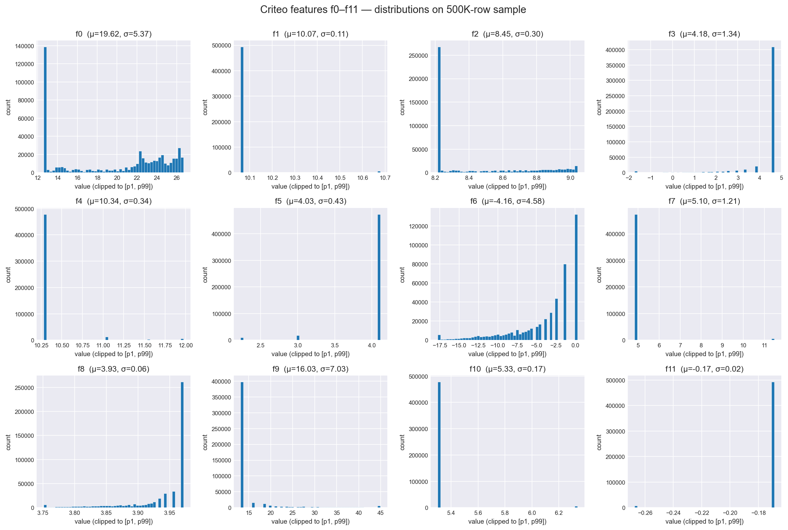

# Data Overview: Criteo Uplift v2.1

## Source

Criteo AI Lab, released alongside Diemert et al. (2018), *A Large Scale
Benchmark for Uplift Modeling* (AdKDD/KDD 2018). Mirror used:
[criteo/criteo-uplift on HuggingFace](https://huggingface.co/datasets/criteo/criteo-uplift).

## Shape

- **Rows:** 13,979,592
- **Columns:** 16 (12 features `f0`–`f11`, plus `treatment`, `conversion`, `visit`, `exposure`)
- **All features are dense floats.** Names anonymized; values randomly projected.

## Treatment / control split

| treatment | n | pct |
|---|---|---|
| 0 (control)   | 2096937 | 0.15 |
| 1 (treated)   | 11882655| 0.85 |

The split is approximately 85/15, matching the spec on the dataset card.

## Outcome rates by treatment group

| treatment | visit_rate | conversion_rate | exposure_rate | n |
|---|---|---|---|---|
| 0 (control) | 0.038201 | 0.001938 | 0.000000 | 2096937 |
| 1 (treated) | 0.048543 | 0.003089 | 0.036037 | 11882655 |

Raw differences (no CIs yet — see Day 4 for formal ATE):

- Visit lift:      `0.010342`
- Conversion lift: `0.001152`

## Notes

- **Conversion is extremely rare** (~0.3% overall). This drives several
  downstream choices: stratified sampling on `(treatment, conversion)`
  to preserve positives, `class_weight="balanced"` for logistic
  regression baselines, and `is_unbalance=True` for LightGBM.
- **Treatment vs. exposure.** `treatment` is the random assignment
  (intent to treat). `exposure` indicates whether the ad actually
  reached the user. We use `treatment` as the causal variable
  throughout — the assignment is what was randomized, so it preserves
  unbiasedness.
- **Treatment imbalance (85/15)** means standard errors on the control
  side are the binding constraint for ATE precision. The dataset is
  still well-powered because of its size, but the imbalance shows up
  again at modeling time (the control-arm T-learner sees ~6x less data
  than the treated-arm one).

## Feature distributions

All 12 features are anonymized dense floats (`f0`–`f11`). Per-feature
summary statistics computed on the full 14M rows are saved at
`docs/figures/feature_summary.csv`. The 12-panel histogram on a 500K-row
sample is at `docs/figures/feature_distributions.png`.

### Notes on shape

<Fill in 2–4 bullets after looking at Cell 7 diagnostics output. Replace
the placeholders with actual feature names and numbers.>

- **Heavy right-tail features:** <e.g. f1, f5> have `tail_severity` > 5,
  meaning the max sits far beyond the p99 relative to the IQR. Likely
  log-scale underlying quantities.
- **Near-Gaussian features:** <e.g. f3, f7> have symmetric distributions
  with mean ≈ median and `p99_to_median_ratio` near 1.
- **Low-variance features:** <if any> have STDDEV close to zero.

These shapes inform two downstream choices:

1. Standardization is appropriate for the linear T-learner baseline
   (Day 8). LightGBM is scale-invariant and doesn't need it.
2. No clipping or transformation at training time — Criteo features
   are already random-projected, so any extreme values are intrinsic
   to the projection, not data errors. The histograms are clipped to
   `[p1, p99]` for visual readability only.